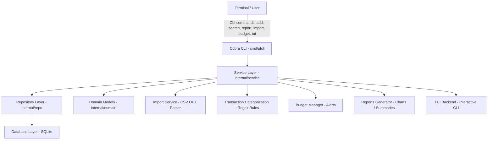

# Project: Personal Finance CLI Manager

## Description

This project is a command-line tool for tracking personal income and expenses.  
The goal is to be able to import transactions from bank statements, categorize them automatically, set budgets, and generate insightful reports — all from the terminal.

This is the full implementation delivered for the ATAD course project.
---

## User Stories

| User Story                                                     | Status | Notes |
|---------------------------------------------------------------|--------|-------|
| Import transactions from CSV files                            | ✅     | `pfcli import --file file.csv` |
| Import transactions from OFX files                            | ✅     | OFX parser implemented |
| Manually add income/expenses                                  | ✅     | `pfcli add` |
| Automatically categorize transactions                         | ✅     | Regex rules via `pfcli rules add` |
| Set budgets per category & receive alerts                     | ✅     | Visible in `pfcli report --by-category` |
| Generate reports (monthly spending, category breakdown)       | ✅     | ASCII bar charts + color |
| Search & filter transactions                                  | ✅     | `pfcli search --text <query>` |
| Interactive TUI for browsing                                  | ✅     | `pfcli tui` |

---

## Usage

The main CLI entrypoint is `pfcli`.

### Available commands

| Command | Description |
|--------|-------------|
| `pfcli add`                                           | Add an income or expense manually |
| `pfcli search --text <query>`                         | Search transactions by description |
| `pfcli report`                                        | Show total income, expenses, balance |
| `pfcli report --by-category`                          | Show category totals + ASCII charts + budget alerts |
| `pfcli import --file <csv|ofx>`                       | Import transactions from CSV or OFX |
| `pfcli rules add --pattern <regex> --category <cat>`  | Add auto-categorization rule |
| `pfcli rules list`                                    | List categorization rules |
| `pfcli budget add --category <cat> --limit <amount>`  | Add a budget limit for a category |
| `pfcli budget list`                                   | List budgets |
| `pfcli tui`                                           | Show a basic interactive terminal UI |

---


## Examples

### ➕ Add a transaction

```bash
pfcli add --amount 25.5 --description "Pizza" --category "Food" --type expense
```
```bash
pfcli add --amount 5000 --description "Salary November" --category "Income" --type income
```


### 🔍 Search transactions

```bash
pfcli search --text Pizza
```
### 📊 Generate financial report

```bash
pfcli report
```

## System Architecture

The project uses a layered architecture with clear separation between CLI, services, repositories, database access and domain models.



## Project Structure

```text
personal-finance-cli/
├── cmd/
│   └── pfcli/
│       └── main.go            # CLI entrypoint
│
├── internal/
│   ├── cli/                   # Cobra commands (add, search, report, import, budget, tui)
│   ├── db/                    # SQLite connection + migrations
│   ├── domain/                # Domain entities (Transaction, etc.)
│   └── repo/                  # TransactionRepo (Insert, SearchByText, Totals)
│
└── docs/
    └── architecture.md        # Detailed architecture description
```

## 🏛️ Architecture Overview

### 🟦 1. CLI Layer (internal/cli)

Handles:

parsing user input

subcommands (add, search, report, etc.)

validation
Framework: Cobra

### 🟩 2. Service Layer (future work)

categorization rules

budgets & alerts

business logic


### 🟧 3. Repository Layer (internal/repo)

Implements:

Insert()

SearchByText()

Totals()

Budgets()

Rules()

Keeps SQL logic isolated from CLI.

### 🟪 4. Database Layer (internal/db)

Responsibilities:

SQLite database initialization

automatic migrations

persistent finance.db file

Driver: glebarez/sqlite (CGO-free)

### 🟨 5. Domain Layer (internal/domain)

Contains pure business objects:

Transaction

TransactionTypeIncome

TransactionTypeExpense


## 📝 Notes (Checkpoint)

✔ Architecture fully defined
✔ All core features implemented
✔ All commands functional
✔ CSV and OFX import
✔ Regex-based categorization
✔ Budgets + alerts
✔ ASCII charts in reports
✔ Interactive TUI implemented

The project is ready for final presentation.


## 🚀 Running the Project

### Clone repository:

git clone https://github.com/RS4POWER/personal-finance-cli
cd personal-finance-cli

### Run CLI:
go run ./cmd/pfcli